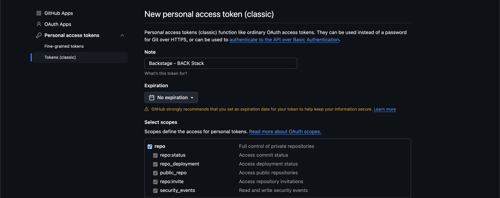
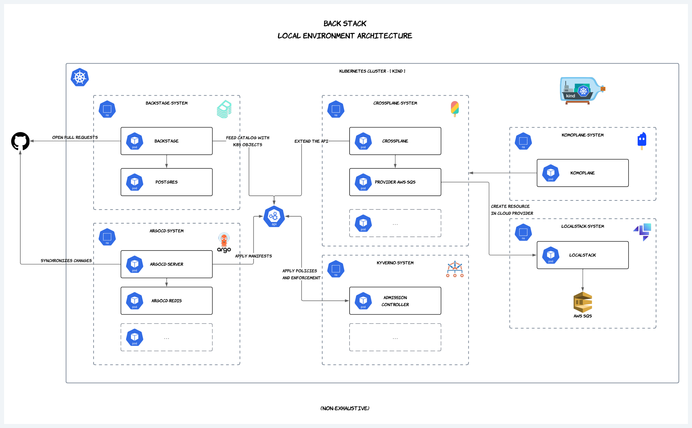

<div align="center">

<h1>Platform Engineering | BACK Stack</h1>

_A ready-to-use environment for modern platform engineering experimentation, combining (B)ackstage, (A)rgoCD, (C)rossplane, and (K)yverno! 🚀_

<figure>
  
  <figcaption>
    <h6>
      <i>
        Interfaces and Capabilities of a Development Platform. Source: CLOUD NATIVE COMPUTING FOUNDATION. Platforms whitepaper. Available at: <a target="_blank" href="https://tag-app-delivery.cncf.io/whitepapers/platforms/#capabilities-of-platforms">https://tag-app-delivery.cncf.io/whitepapers/platforms/#capabilities-of-platforms</a>.
      </i>
    </h6>
  </figcaption>
</figure>

> _🚧 Under construction 🚧_

</div>

## Summary

- [Motivation ✨](#motivation-)
- [Stack](#stack)
- [Prerequisites](#prerequisites)
- [Up \& Running](#up--running)
  - [Troubleshooting](#troubleshooting)
  - [Accessing Applications](#accessing-applications)
- [Architecture](#architecture)
- [Roadmap 🚧](#roadmap-)
- [How to Contribute](#how-to-contribute)

## Motivation ✨

**Platform Engineering** requires integrating multiple tools to provide developers with a seamless and efficient experience. Building an **Internal Developer Platform (IDP)** involves solutions for automation, infrastructure provisioning, access control, observability, and continuous delivery workflows, which makes it challenging for both beginners and experienced teams.

Tools like **Backstage, Crossplane, and ArgoCD** are commonly used to create a unified developer experience, but experimenting with and understanding how they work together can be hard without a properly configured environment. Each technology brings its own concepts and abstraction layers, making the learning and implementation process fragmented.

This project was created to meet the need for an **easy-to-run local environment**, enabling quick experimentation with the core technologies involved in platform engineering. The goal is to provide a **functional and reproducible stack**, reducing initial complexity and enabling hands-on exploration before deploying these solutions in a production setting.

With this stack, you can:

- ✅ Quickly test integration between Backstage, Crossplane, and ArgoCD.
- ✅ Simulate an IDP experience in a local setup.
- ✅ Understand the challenges and benefits of each tool.
- ✅ Create and modify infrastructure compositions using GitOps.

If you're interested in platform engineering and want to explore how these tools fit together, this repository is a great place to start! 🚀

## Stack

This repository brings together essential tools to build and experiment with a local **Internal Developer Platform (IDP)**. Below is a brief description of each component:

- **Backstage**: An open-source developer portal created by Spotify, designed to unify tools, services, and documentation into a single interface. It provides a **service catalog**, allowing teams to organize and discover APIs, infrastructure, and documentation centrally, promoting standardization and development efficiency.

- **ArgoCD**: A GitOps continuous delivery controller for Kubernetes, responsible for managing and syncing applications defined via Git-based manifests.

- **Crossplane**: A Kubernetes-native infrastructure provisioning tool that enables declarative cloud and on-prem resource management via **Compositions**.

- **Kyverno**: A policy engine for Kubernetes that enables enforcement and validation of compliance and security rules in clusters.

- **LocalStack**: A fully functional local AWS cloud emulator that enables developers to test and build applications interacting with AWS services without needing a real AWS account.

- **Komoplane**: A project to experiment with Crossplane resource visualization. The goal is to help Crossplane users understand control plane resource structure and accelerate troubleshooting.

- **Helm**: A package manager for Kubernetes that simplifies deploying complex applications using reusable _charts_.

- **kind** (Kubernetes in Docker): A tool for running local Kubernetes clusters using Docker containers, ideal for testing and development.

- **kubectl**: The official Kubernetes command-line tool (CLI) for interacting with clusters, applying configurations, and managing resources.

## Prerequisites

Make sure the following dependencies are installed before running any commands:

- [`kind`](https://kind.sigs.k8s.io/docs/user/quick-start/) (version v0.27.0 or higher);
- [`kubectl`](https://kubernetes.io/docs/tasks/tools/) (version v1.32.2 or higher);
- [`argocd`](https://argo-cd.readthedocs.io/en/stable/cli_installation/) (version v2.14.2 or higher);
- [`helm`](https://helm.sh/docs/intro/install/) (version v3.17.1 or higher);
- [Docker](https://docs.docker.com/engine/install/) (version 27.4.0 or higher).

> _⚠️ Installation of these basic tools is not covered here as it varies by operating system. The following scripts assume you have each one properly set up._

Before proceeding, make sure you have also completed the following steps:

1. **Fork this repository** to your GitHub account.
2. **Clone your fork** locally:
   ```bash
   git clone https://github.com/<your-username>/<repository-name>.git
   cd <repository-name>
   ```
3. **Create a `.env` file** at the root of the project based on the provided `.env.example`:
   ```bash
   cp .env.example .env
   ```
4. **Generate a GitHub Personal Access Token** with full `repo` permissions by visiting [https://github.com/settings/tokens/new](https://github.com/settings/tokens/new).
   
5. **Update the `.env` file** with your generated token, replacing the `"placeholder"` value.

> 💡 The GitHub token will be used to open pull requests in the repository and to read the catalog file for loading into Backstage.

## Up & Running

This project uses a Makefile to simplify environment setup and teardown. Follow the steps below to get started.

If you don't have the `make` command in your environment, install it according to your operating system:

<details>
  <summary>Ubuntu/Debian</summary>

```sh
sudo apt update && sudo apt install -y make
```

Verify installation:

```sh
make --version
```

Install build tools if needed:

```sh
sudo apt update && sudo apt install -y build-essential
```

</details>

<details>
  <summary>Fedora</summary>

```sh
sudo dnf install -y make
```

Verify installation:

```sh
make --version
```

Install build tools if needed:

```sh
sudo dnf groupinstall -y "Development Tools"
```

</details>

<details>
  <summary>Arch Linux</summary>

```sh
sudo pacman -Syu make
```

Verify installation:

```sh
make --version
```

Install build tools if needed:

```sh
sudo pacman -Syu base-devel
```

</details>

<details>
  <summary>macOS (via Homebrew)</summary>

```sh
brew install make
```

Verify installation:

```sh
make --version
```

Install Xcode development tools if needed:

```sh
xcode-select --install
```

</details>

<details>
  <summary>Windows (via MSYS2)</summary>

1. Download and install [MSYS2](https://www.msys2.org/).
2. Open the MSYS2 terminal and run:

```sh
pacman -S make
```

Verify installation:

```sh
make --version
```

For a complete development environment:

```sh
pacman -S base-devel
```

</details>

<br/>

To set up the environment, run:

```sh
make up
```

This command will:

- Check if required dependencies are installed.
- Create a Kubernetes cluster named `platform` (if it does not already exist).
- Run bootstrap scripts for LocalStack, Crossplane, Komoplane, and ArgoCD.

To tear down the environment, run:

```sh
make down
```

This command will:

- Check if required dependencies are installed.
- Delete the Kubernetes `platform` cluster if it exists.

### Troubleshooting

If you encounter issues, ensure that:

- All required binaries are installed and available in your system `PATH`.
- The `kind` clusters are running before applying any `kubectl` instructions.

For additional help, refer to the documentation links in the prerequisites section.

### Accessing Applications

Applications are exposed via `nohup` + `kubectl port-forward`.

| Application | Address                                        | Notes                                                                                           |
| ----------- | ---------------------------------------------- | ----------------------------------------------------------------------------------------------- |
| Backstage   | [http://localhost:3000](http://localhost:3000) | Enter as a Guest User.                                                                          |
| Argo CD     | [http://localhost:8080](http://localhost:8080) | Username: `admin` <br/> Password: `12345678`                                                    |
| Komoplane   | [http://localhost:8090](http://localhost:8090) | -                                                                                               |
| Localstack  | [http://localhost:4566](http://localhost:4566) | Manage it via: [https://app.localstack.cloud/instances](https://app.localstack.cloud/instances) |

## Architecture

Below is a high-level architecture diagram showing how the components interact:



## Roadmap 🚧

This section outlines upcoming improvements and planned changes for this project:

- [ ] Reduce the responsibility of the `.bootstrap/**/up.sh` scripts: shift tool installation and configuration to ArgoCD so that it manages not only Crossplane claims but also the cluster setup itself — making the environment closer to real-world GitOps practices.

- [ ] Improve the Kyverno GitHub Action: update the CI pipeline to apply only the policies related to the resources changed in a given Pull Request.

- [ ] Evaluate the use of the **TeraSky Kubernetes Ingestor plugin** for Backstage ([link](https://github.com/TeraSky-OSS/backstage-plugins/tree/main/plugins/kubernetes-ingestor)): current integration attempts led to infinite loops, very few users seem to rely on it, and documentation is limited.

- [ ] Evaluate the **TeraSky Crossplane Resources plugin** for Backstage ([link](https://github.com/TeraSky-OSS/backstage-plugins/tree/main/plugins/crossplane-resources)): provides a useful UI and presents a compelling case for exposing infrastructure views not just to solution engineers but also to platform engineers. However, it depends on the Kubernetes Ingestor plugin.

## How to Contribute

I welcome contributions! 🎉

Before starting, please take a moment to review the [Contributing Guidelines](./CONTRIBUTING.md).
